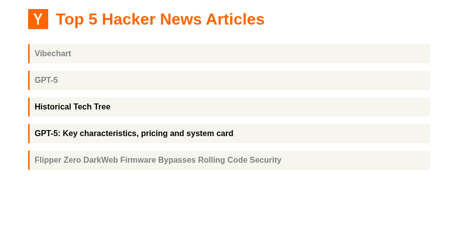

<div align="center">

# Hacker News Top 5 Articles




</div>

A simple web application built with Rust and Axum that fetches and displays the top 5 articles from Hacker News. Perfect for those who get anxious seeing too many news  but don't have time to read everything.

## Installation

1. **Clone this repository:**

```bash
git clone https://github.com/mateolafalce/hacker5news.git
cd hacker5news
```

2. **Install the application using Cargo:**

```bash
cargo install --path .
```

3. **Run the application:**

```bash
hacker5news
```

4. **The application will automatically open in your default browser.**  

If it doesn't, open your browser and go to:

```
http://localhost:3000
```

## License

This project is open source and available under the [MIT License](LICENSE).

## Acknowledgments

- [Hacker News API](https://github.com/HackerNews/API) for providing the data
- [Axum](https://github.com/tokio-rs/axum) for the excellent web framework